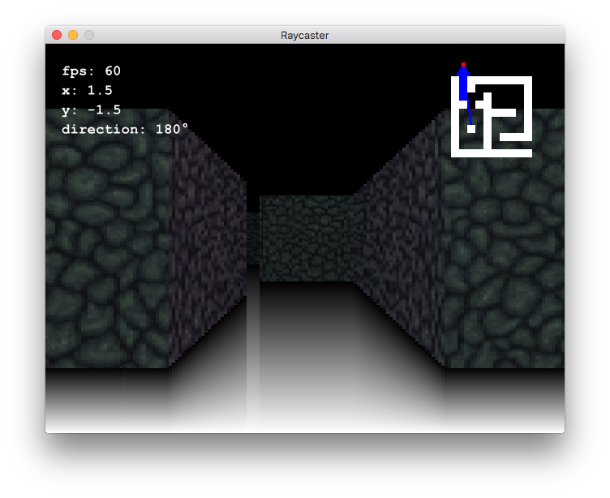

# 🔆 Raycaster

Experimental ray casting renderer written in Ruby using [Gosu](https://www.libgosu.org/).



## Installation

Install Gosu dependencies (macOS).

```sh
brew install sdl2
```

For Linux dependencies, read [Getting Started on Linux](https://github.com/gosu/gosu/wiki/Getting-Started-on-Linux).

Install gems.

```sh
bundle install
```

Start.

```sh
ruby raycaster.rb
```

Use WASD or arrows to move.

## Credits

- Thanks [@hunterloftis](https://github.com/hunterloftis) for your awesome [artice](http://www.playfuljs.com/a-first-person-engine-in-265-lines/).
- Thanks [CyberDagger](http://cyberdagger.deviantart.com/) for the sexy [texture](http://cyberdagger.deviantart.com/art/Dark-Stone-Floor-Texture-301408108).
